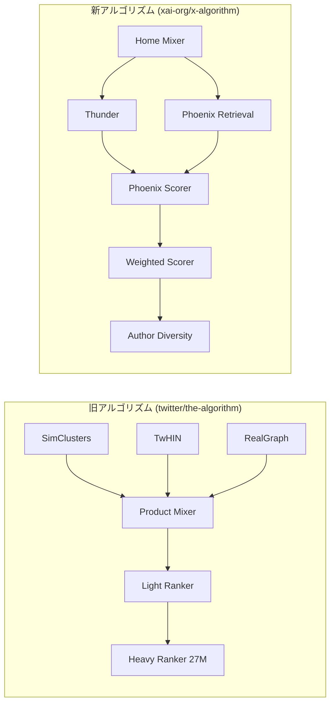

# xai-org/x-algorithm 徹底分析 → Matri-X フォーラム統合計画

## 背景

2026年2月、イーロン・マスクにより **[xai-org/x-algorithm](https://github.com/xai-org/x-algorithm)** が公開された。これは旧 `twitter/the-algorithm` (2023年公開・Java/Scala中心) を**完全に置き換える**、Xの「For You」フィードを駆動する最新の推薦アルゴリズムである。

現行の Matri-X プラットフォーム (https://www.matri-x-algo.wiki/) は旧アルゴリズムをベースにしており、この新コードベースへの対応が急務。

---

## 新旧アルゴリズム 徹底比較分析

### 言語 & テクノロジー

| 項目 | 旧 (`twitter/the-algorithm`) | 新 (`xai-org/x-algorithm`) |
|:---|:---|:---|
| **言語** | Java 48%, Scala 34%, Python 5% | **Rust 62.9%, Python 37.1%** |
| **ML フレームワーク** | TensorFlow (Navi) | **Grok-1 ベース (PyTorch/JAX)** |
| **ビルドシステム** | Bazel | **Cargo (Rust) + uv (Python)** |
| **ライセンス** | AGPL-3.0 | **Apache-2.0** |
| **公開組織** | twitter | **xai-org** |

### アーキテクチャの根本的変化



### 4大コンポーネント詳解

#### 1. Home Mixer (Rust) — オーケストレーション層

| 旧 | 新 |
|:---|:---|
| Product Mixer (Scala) | **Home Mixer (Rust)** |
| Thrift RPC | **gRPC (`ScoredPostsService`)** |

- `CandidatePipeline` フレームワークを使用
- Source → Hydration → Filter → Score → Select → SideEffect の6段パイプライン

#### 2. Thunder (Rust) — インネットワーク投稿ストア

**完全に新しいコンポーネント** (旧アルゴリズムに直接対応なし)

- **Kafka** からリアルタイムにポスト作成/削除イベントを取り込み
- ユーザーごとに **Original / Reply+Repost / Video** の3種別でインメモリ管理
- **サブミリ秒** でフォロー中アカウントの投稿を取得
- 自動的に期限切れ投稿をトリミング

#### 3. Phoenix (Python) — Grok ベース ML エンジン

最大の革新。2ステージで動作:

##### Stage 1: Retrieval (Two-Tower Model)
- **User Tower**: ユーザーの特徴量 + エンゲージメント履歴を Transformer でエンコード → 正規化された埋め込み `[B, D]`
- **Candidate Tower**: コーパス全体の投稿を埋め込み `[N, D]`
- **Dot Product 類似度検索**: Top-K候補を取得 (数百万 → 数千)

##### Stage 2: Ranking (Transformer + Candidate Isolation)
- **Candidate Isolation**: 候補同士は互いに attend できない (自分自身のみ)
- **15種類のエンゲージメント予測** を同時出力:

| 予測対象 | カテゴリ |
|:---|:---|
| `P(favorite)`, `P(reply)`, `P(repost)`, `P(quote)` | ポジティブ |
| `P(click)`, `P(profile_click)`, `P(video_view)` | インタレスト |
| `P(photo_expand)`, `P(share)`, `P(dwell)` | コンテンツ消費 |
| `P(follow_author)` | ソーシャル |
| `P(not_interested)`, `P(block_author)`, `P(mute_author)`, `P(report)` | **ネガティブ** |

最終スコア: `Σ (weight_i × P(action_i))` — ポジティブは正の重み、ネガティブは負の重み。

#### 4. Candidate Pipeline (Rust) — 再利用可能フレームワーク

6つの trait で構成:

```
Source → Hydrator → Filter → Scorer → Selector → SideEffect
```

- 独立ステージの **並列実行**
- グレースフルエラーハンドリング
- ビジネスロジックとパイプライン実行の分離

### 5つの重要設計思想

| # | 設計思想 | 意味 |
|:---|:---|:---|
| 1 | **手動特徴量エンジニアリングの完全排除** | Grok Transformer がすべてを学習 |
| 2 | **Candidate Isolation** | スコアがバッチ内の他候補に依存しない → キャッシュ可能 |
| 3 | **Hash-Based Embeddings** | 複数ハッシュ関数によるルックアップ |
| 4 | **Multi-Action Prediction** | 単一「関連度」→ **15アクション別確率** |
| 5 | **Composable Pipeline** | Rust trait による型安全な拡張性 |

### フィルタリングシステム

**Pre-Scoring (10フィルタ)**:
`DropDuplicates`, `CoreDataHydration`, `Age`, `Selfpost`, `RepostDeduplication`, `IneligibleSubscription`, `PreviouslySeenPosts`, `PreviouslyServedPosts`, `MutedKeyword`, `AuthorSocialgraph`

**Post-Selection (2フィルタ)**:
`VFFilter` (Visibility Filtering), `DedupConversation`

---

## User Review Required

> [!IMPORTANT]
> この計画は Matri-X プラットフォームに**大規模なコンテンツ更新**を行います。以下の方針について確認をお願いします:
> 1. 旧アルゴリズム (`twitter/the-algorithm`) のコンテンツを **残しつつ新旧比較形式にするか**、完全に **新アルゴリズムに置き換えるか**
> 2. 新しいページ (`/phoenix`, `/thunder` 等) の **優先順位**
> 3. DeepWiki の参照先を `xai-org/x-algorithm` に切り替えるタイミング

---

## Proposed Changes

### Component 1: 定数 & データモデル更新

#### [MODIFY] [constants.ts](file:///lib/constants.ts)

- `ENGAGEMENT_WEIGHTS` の更新: 15アクション予測体系に対応
  - 新規追加: `P(quote)`, `P(video_view)`, `P(photo_expand)`, `P(share)`, `P(dwell)`, `P(follow_author)`, `P(not_interested)`, `P(block_author)`, `P(mute_author)`, `P(report)`
- `PIPELINE_STAGES` の刷新: Home Mixer → Thunder/Phoenix → Scoring → Selection
- `ALGORITHM_COMPONENTS` の更新: SimClusters/TwHIN/RealGraph → **Phoenix/Thunder/Home Mixer/Candidate Pipeline**
- `HEAVY_RANKER` → `PHOENIX_RANKER`: Grok-based Transformer + Candidate Isolation
- 新定数 `PHOENIX_PREDICTIONS`: 15種類の予測アクション一覧
- 新定数 `FILTERS`: Pre-Scoring (10) + Post-Selection (2) フィルタ名一覧
- `TECH_STACK_COMPARISON`: 旧(Java/Scala) vs 新(Rust/Python) メタデータ

#### [MODIFY] [types/index.ts](file:///types/index.ts)

- 新 interface: `PhoenixPrediction`, `FilterStage`, `CandidatePipelineStage`
- 既存の `EngagementWeight` 型を拡張

---

### Component 2: 新規ページ — Phoenix Deep Dive

#### [NEW] [app/phoenix/page.tsx](file:///app/phoenix/page.tsx)

**Phoenix アルゴリズム解説ページ** — 最大のハイライト

- Two-Tower Retrieval の視覚化 (User Tower ↔ Candidate Tower のアニメーション)
- **Candidate Isolation Attention Mask** のインタラクティブ可視化
  - `✓/✗` マトリクスをアニメーションで表示
  - ユーザーが候補数を変更してマスクがどう変わるか体験
- 15アクション予測の **レーダーチャート** 表示
- ポジティブ vs ネガティブ重みの視覚的バランス図
- 旧 Heavy Ranker (27M) との比較セクション

---

### Component 3: 新規ページ — Thunder インメモリストア

#### [NEW] [app/thunder/page.tsx](file:///app/thunder/page.tsx)

**Thunder リアルタイムパイプライン解説ページ**

- Kafka イベントストリームの流れをアニメーション表示
- 3種別ストア (Original / Reply+Repost / Video) の視覚的説明
- インメモリ vs 外部DB の応答速度比較グラフ
- 投稿の TTL (Time To Live) トリミングの仕組み解説

---

### Component 4: 新規ページ — 新旧アルゴリズム比較

#### [NEW] [app/comparison/page.tsx](file:///app/comparison/page.tsx)

**「2023 vs 2026: Xアルゴリズムの進化」比較ページ**

- 言語変遷 (Java/Scala → Rust/Python) のインフォグラフィック
- パイプライン構造の Before/After diff 視覚化
- 設計思想の5大変化をカード形式で解説
- 性能・スケーラビリティの推測比較

---

### Component 5: 既存ページの改修

#### [MODIFY] [app/explore/page.tsx](file:///app/explore/page.tsx)

- パイプライン全体図を新アーキテクチャに更新
- Home Mixer → Thunder/Phoenix Retrieval → Hydration → Filtering → Phoenix Scoring → Weighted Scorer → Author Diversity → Selection → Post-Filtering
- 旧パイプラインとの切り替えトグル (「2023版を見る」)

#### [MODIFY] [app/simulator/page.tsx](file:///app/simulator/page.tsx)

- **Phoenix Scorer シミュレーター v3**: 15 アクション確率入力 → 重み付きスコア計算
- ネガティブシグナル (`not_interested`, `block`, `mute`, `report`) の影響を視覚化
- 「旧方式 (固定重み)」 vs 「新方式 (ML予測ベース)」の比較モード

#### [MODIFY] [app/simclusters/page.tsx](file:///app/simclusters/page.tsx)

- SimClusters が新アルゴリズムでは **Phoenix Two-Tower Retrieval に置き換わった** ことを解説
- 旧方式 (コミュニティ検出ベース) vs 新方式 (Two-Tower NN ベース) の対比セクション

#### [MODIFY] [app/updates/page.tsx](file:///app/updates/page.tsx)

- タイムラインに **2026年2月: xai-org/x-algorithm 公開** エントリ追加
- 「手動特徴量エンジニアリング排除」「Rust リライト」「Grok統合」をハイライト

#### [MODIFY] [app/protection/page.tsx](file:///app/protection/page.tsx)

- フィルタリングシステムを Pre-Scoring (10) + Post-Selection (2) に更新
- `VFFilter`, `AuthorSocialgraphFilter` 等の新フィルタ名を追加
- Visibility Filtering の仕組みを新コードに基づき改修

---

### Component 6: DeepWiki ソースコード対象の更新

#### [MODIFY] [app/deepwiki/page.tsx](file:///app/deepwiki/page.tsx)

- 検索対象リポジトリを `twitter/the-algorithm` → `xai-org/x-algorithm` に変更
- Rust ファイル (.rs) と Python ファイル (.py) に対応
- サジェストクエリの更新: 「PhoenixModel の forward 関数」「Thunder の Kafka consumer」等

---

### Component 7: ナビゲーション & ランディングページ

#### [MODIFY] [components/Header.tsx](file:///components/Header.tsx)

- サイドバー / ナビに `/phoenix`, `/thunder`, `/comparison` リンクを追加

#### [MODIFY] [app/page.tsx](file:///app/page.tsx)

- ランディングページのパイプライン概要を新アーキテクチャに更新
- 「xai-org/x-algorithm 対応」バッジの追加
- 8つの主要機能カードに **Phoenix** と **Thunder** を追加

---

### Component 8: コミュニティフォーラム (新カテゴリ)

#### [MODIFY] Forum Category Seed Data

- 新カテゴリ追加:
  - **🦀 Rust リライト分析** — Home Mixer / Thunder / Candidate Pipeline のRustコード解読
  - **🤖 Phoenix & Grok** — ML モデル、Two-Tower、Transformer の技術的議論
  - **⚖️ 新旧比較** — 旧アルゴリズムからの移行で何が変わったか

---

## Verification Plan

### Automated Tests

```bash
# TypeScript 型チェック
pnpm tsc --noEmit

# ビルド検証
pnpm build
```

### Manual Verification (ユーザー確認)

1. **ランディングページ**: パイプライン概要が新アーキテクチャに更新されていること
2. **`/phoenix` ページ**: Two-Tower & Candidate Isolation の視覚化が正しく動作すること
3. **`/thunder` ページ**: Kafka ストリームアニメーションが表示されること
4. **`/comparison` ページ**: 新旧比較が分かりやすく表示されること
5. **`/simulator` ページ**: 15アクション入力のシミュレーターが動作すること
6. **`/explore` ページ**: パイプライン図が新構造に更新されていること
7. **ナビゲーション**: 新ページへのリンクが正しく動作すること
8. **レスポンシブ**: モバイルでの新ページ表示を確認
9. **matri-x-algo.wiki にデプロイ後の確認** をユーザーに依頼
